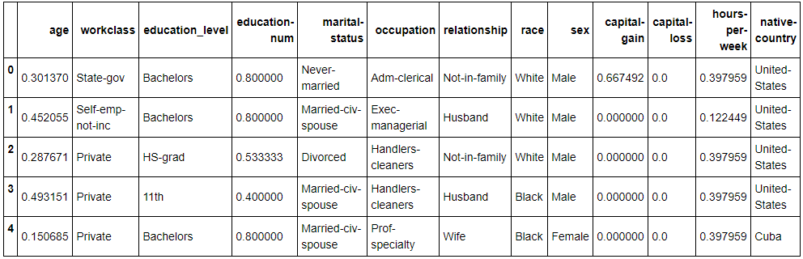
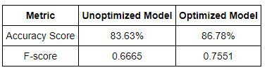

# Predicting Donors for CharityML

CharityML is a fictitious charity organization located in the heart of Silicon Valley that was established to provide financial support for people eager to learn machine learning. After nearly 32,000 letters were sent to people in the community, CharityML determined that every donation they received came from someone that was making more than $50,000 annually. To expand their potential donor base, CharityML has decided to send letters to residents of California, but to only those most likely to donate to the charity. With nearly 15 million working Californians, CharityML has brought you on board to help build an algorithm to best identify potential donors and reduce overhead cost of sending mail. My goal was to evaluate and optimize several different supervised learners to determine which algorithm will provide the highest donation yield while also reducing the total number of letters being sent.

## Goal of the project:
To construct a model that accurately predicts whether an individual makes more than **$50,000.**

## Data Exploration:
* Total number of records: **45222**
* Individuals making more than $50,000: **11208**
* Individuals making at most $50,000: **34014**
* Percentage of individuals making more than $50,000: **24.784%**

## Data Preparation:
Before data can be used as input for machine learning algorithms, it often must be cleaned, formatted, and restructured — this is typically known as preprocessing. Fortunately, for this dataset, there are no invalid or missing entries we must deal with, however, there are some qualities about certain features that must be adjusted. This preprocessing can help tremendously with the outcome and predictive power of nearly all learning algorithms.

### Transforming Skewed Continuous Features:
A dataset may sometimes contain at least one feature whose values tend to lie near a single number, but will also have a non-trivial number of vastly larger or smaller values than that single number. Algorithms can be sensitive to such distributions of values and can under perform if the range is not properly normalized. With our dataset two features fit this description: ```capital-gain ``` and ```capital-loss```


For highly-skewed feature distributions such as 'capital-gain' and 'capital-loss', it is common practice to apply a logarithmic transformation on the data so that the very large and very small values do not negatively affect the performance of a learning algorithm. Using a logarithmic transformation significantly reduces the range of values caused by outliers. Care must be taken when applying this transformation however: The logarithm of 0 is undefined, so we must translate the values by a small amount above 0 to apply the the logarithm successfully


### Normalizing Numerical Features:
In addition to performing transformations on features that are highly skewed, it is often good practice to perform some type of scaling on numerical features. Applying a scaling to the data does not change the shape of each feature's distribution (such as ``` capital-gain ``` or ``` capital-loss ``` above); however, normalization ensures that each feature is treated equally when applying supervised learners. Note that once scaling is applied, observing the data in its raw form will no longer have the same original meaning, as exampled below.



### Model Building:
We need a benchmark score to evaluate the model that we build. Let's calculate the benchmark score by predicting the income of all the people is above $50,000. In this method, everyone becomes a donor for CharityML. The accuracy score and f-score of this model are 0.2478 and 0.2917 respectively. So, our benchmark accuracy score is 24.78% and benchmark f-score is 0.29. 

The model I choose, comparing all the models is "Adaboost". Lets us see a comparison chart of accuracy scores, f-scores and time of selected three models on different sizes of our dataset:



Based on the above results, I choose Adaboost model. Adaboost model gave us f-score of around 0.7 on 100% test and train data. While, Random Forests gave a very high f-score on training data (close to 1) while it gave f-score of around 0.6 on testing data. This clearly says that the Random Forest model tends to overfit on this data. Regarding training and testing time, Random Forests performed faster than Adaboost model. But, as this model is not a real time prediction and there is limited data, We give our priority to performance and accuracy thus choosing Adaboost model.

### What is Adaboost?
Adaboost is an algorithm that combines multiple "weak learners" to create one **strong learner**. Let us explain this with a general example. Suppose we are having three friends A,B,C who are good at computers, sports and science respectively. Now, think a person D, want build a chatbot that answers to the questions related to Computers, Sports and Science.So, D combines the knowledge of all three friends A,B,C to build his chatbot. Here, A,B and C are called "Weak Learners" and the chatbot built by D is called "Strong Learner". We have to notice here that the combination of the weak learners is done according to the weights assigned by the algorithm.

### Why Boosting?
Boosting is normally combination on multiple weak learners to create a strong learner. But why do we combine the models? The answer is explained in simple terms in above example. Normal models aka weak learners tend to have high bias and variance. Boosting reduces this bias and variance. and creates a good strong learner that has less variance and bias.

After selecting the model, I have tuned some parameters of the model by using GridSearchCV. The comparison of results of unoptimized and optimized models: 


The accuracy score and f-score of the unoptimized model are **0.8363** and **0.6665** respectively. While the accuracy and f-score of optimized model are **0.8678** and **0.7551** respectively. This was a huge improvement from our Naive Predictor in which the accuracy and f-score are 0.2478 and 0.2917 respectively.

__Thank You for your time__ 

with :heart:, __Brungi Vishwa Sourab__
